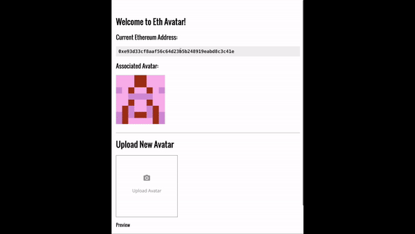

# Eth Avatar - Gravatar for Ethereum addresses

***Eth Avatar*** associates an avatar of your choice with an Ethereum address that you own.

We hope this project will be a "gravatar for ethereum addresses".

This project is free and open source.  We hope to see other projects make use of it!  The more projects use it, the more useful it is.  

## Possible Use Cases
* **Visual Verification:** When sending ether to an exchange for instance, instead of being paranoid if you've pasted the correct address, wallets that support Eth Avatar will be able to fetch the exchange logo as a forms of visual verification. The same also works the other way around when transferring from the exchange to your own wallet.
* **Token Branding:** Tokens and contracts will be able to associate branding artwork to their addresses, allowing it to be possibly visible on EtherScan and exchanges once they support Eth Avatar.
* **Personal Use** It's fun to associate avatars with your personal addresses and be able to visually differentiate between them in your wallets.

## Demo

<a href="https://ethavatar.com"></a>

## How it works

The avatar image is stored on [IPFS](https://ipfs.io) and is bound to your address via an Ethereum [smart contract](https://etherscan.io/address/0x4FbF2f1613Cc86314b22AE10Ae95D19cF2990824#code).

## Current Deployments
* Dapp: https://ethavatar.com (make sure you visit using an Ethereum browser)
* Smart Contract: https://etherscan.io/address/0x5d5194e9aa451d36ec4faa62609d18e1ed6765a4#code

## To Integrate Into your App

```
// assumes you're running web3.js and ipfs.js already!  
// todo: well need to host web3.js and ipfs-api.js on ethavatar.co so folks can pull down from there
// https://gitcoin.co/static/v2/js/ipfs-api.js
// var ipfs = ipfsAPI('ipfs.infura.io', '5001', {protocol: 'https'}); // connect to the unfura IPFS node

// setup
var eth_avatar_abi = [{"constant": false, "inputs": [], "name": "getIPFSHash", "outputs": [{"name": "", "type": "string"}], "payable": false, "type": "function"}, {"constant": false, "inputs": [{"name": "hash", "type": "string"}], "name": "setIPFSHash", "outputs": [], "payable": false, "type": "function"}, {"anonymous": false, "inputs": [{"indexed": true, "name": "hashAddress", "type": "address"}, {"indexed": false, "name": "hash", "type": "string"}], "name": "DidSetIPFSHash", "type": "event"}]
var eth_avatar_address = '0x4FbF2f1613Cc86314b22AE10Ae95D19cF2990824'; //mainnet
var eth_avatar_contract = web3.eth.contract(eth_avatar_abi).at(eth_avatar_address);

// configure inputs
var target_address = web3.eth.coinbase; // TODO - your address

// get the IPFS data
eth_avatar_contract.getIPFSHash.call((err, result) => {
    var ipfs_hash = result;
    ipfs.files.get(ipfs_hash, (err, result) => {
      if(err) {
        console.error('**Error fetching avatar data from IPFS: ' + err);
        return;
      }

      // need help from tarek -- what if the hashcontent is empty?

      var hashContent = result[0].content;
      var avatarDataBuffer = Buffer.from(hashContent);

      // we've got the data
      var avatarData = JSON.parse(avatarDataBuffer.toString());
      // TODO - use the avatar data for something
      // avatarData.title

      // Now fetch the image itself
      ipfs.files.get(avatarData.imageHash, (err, result) => {
        if(err) {
          console.error('**Error fetching avatar image from IPFS: ' + err);
          return;
        }

        var imageContent = result[0].content;
        var imageBlob = new Blob( [ imageContent ], { type: "image/jpeg" } );
        var imageURL = window.URL.createObjectURL(imageBlob);
        // TODO - use the avatar data for something

      });
    })
})
```

## Deploying the smart contract and web dapp locally

**Before you start, make sure you have both [npm](https://www.npmjs.com/) & [Node.js](https://nodejs.org) installed**

1. Install Truffle.

    `$ npm install -g truffle`

2. Download and launch [Ganache](http://truffleframework.com/ganache/). Make sure Ganache is running on port `7545`.

3. Clone the repository to a folder of your choice.

    `$ git clone https://github.com/gitcoinco/ethavatar.git`

4. Fetch all required packages.

    ```
    $ cd ethavatar
    $ npm install
    ```

5. Deploy the smart contract to Ganache.

    `$ truffle migrate`

6. Launch the Dapp

    `$ npm run start`


<!-- Google Analytics -->

